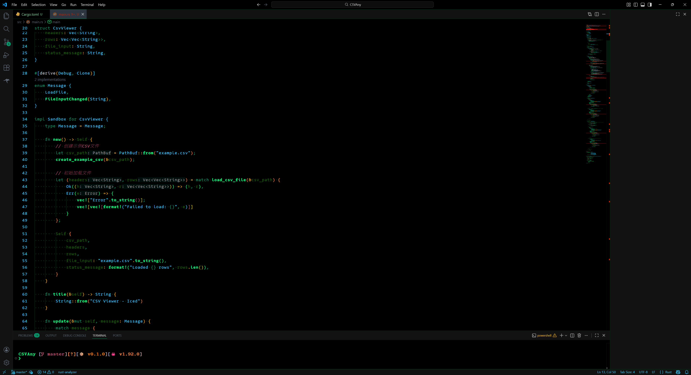

# Heisenberg_Retro Theme for VS Code

A dark theme for Visual Studio Code based on the Heisenberg color theme from Helix editor.



## Features

- **Dark theme** with high contrast for better readability
- **Syntax highlighting** based on the original Heisenberg Helix theme
- **Semantic token support** for improved language understanding
- **Full UI theming** including terminal, sidebar, and editor components
- **Color-coordinated** with the original palette

## Color Palette

| Color | Hex | Usage |
|-------|-----|-------|
| Background | `#000000` | Main background |
| Foreground | `#cccccc` | Text |
| Crystal Blue | `#32c9fa` | Types, strings, active UI |
| Barium Green | `#009669` | Keywords, punctuation |
| Hazmat Yellow | `#f7b90c` | Constants, operators |
| Vapor Yellow | `#cecd19` | Labels, special strings |
| Teddy Bear Pink | `#bd5173` | Comments |
| Cash Green | `#00ff80` | Functions |
| Element Green | `#186800` | Variables |
| Desert Maroon | `#2B0C02` | Primary selection |
| Chili Powder Red | `#c32101` | Errors |
| Orange | `#ff8f40` | Regex, raw blocks |

## Installation

1. Open the Extensions sidebar in VS Code
2. Search for "Heisenberg_Retro"
3. Click Install
4. Go to `File > Preferences > Color Theme` and select "Heisenberg_Retro"

## Manual Installation

1. Download the latest `heisenberg-retro-0.0.1.vsix` file from the releases page
2. In VS Code, go to `View > Command Palette`
3. Type `Extensions: Install from VSIX`
4. Select the downloaded file

## Development

To build from source:

```bash
# Clone the repository
 git clone https://github.com/CatalystPulse/heisenberg-retro
